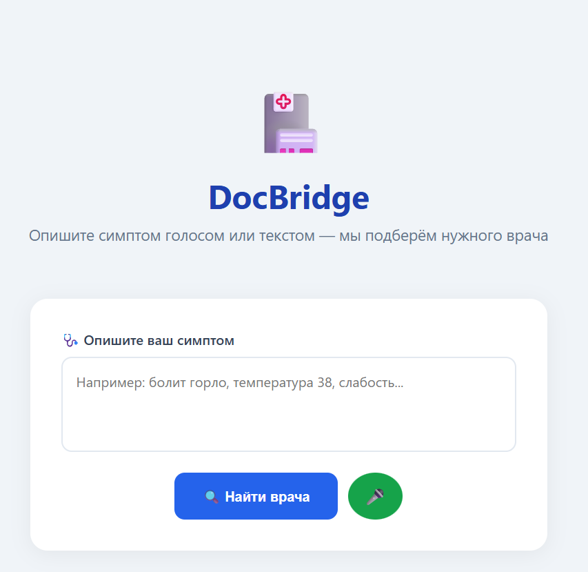
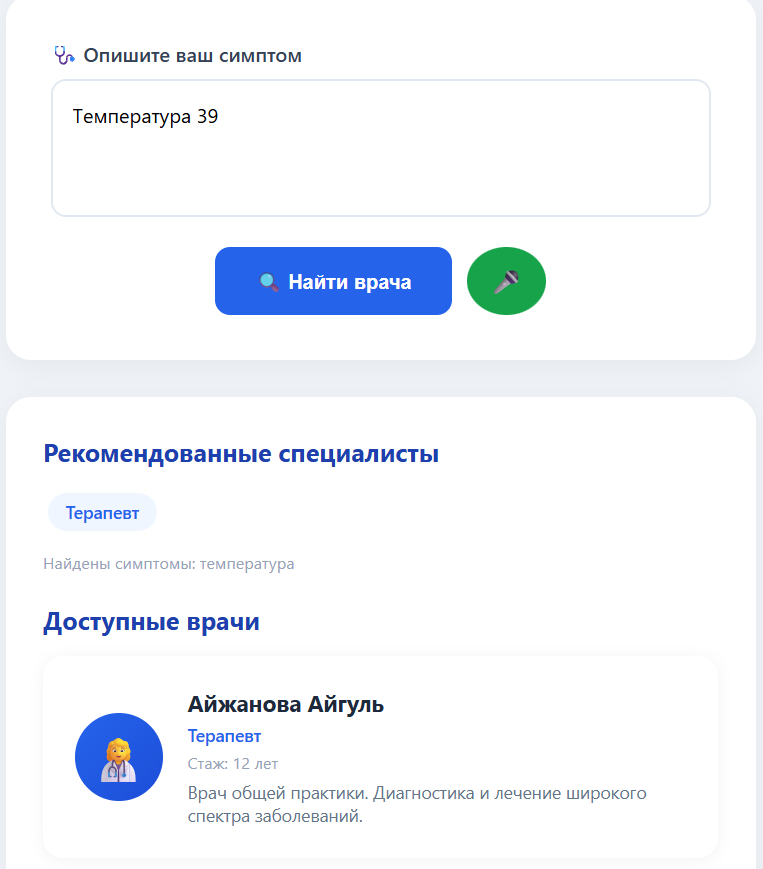
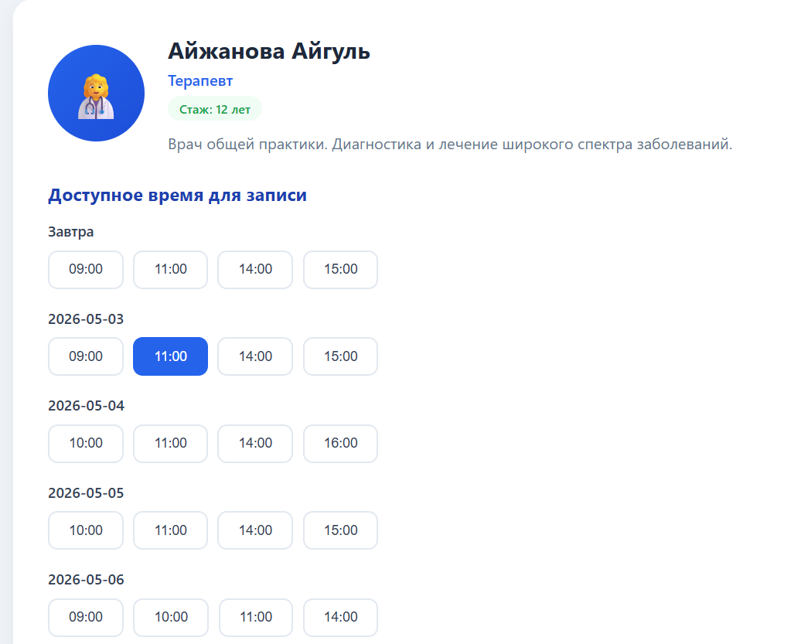
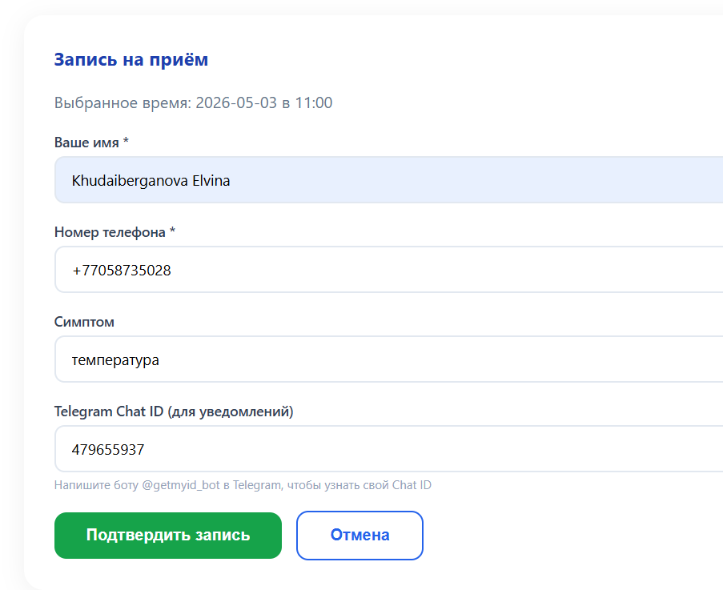
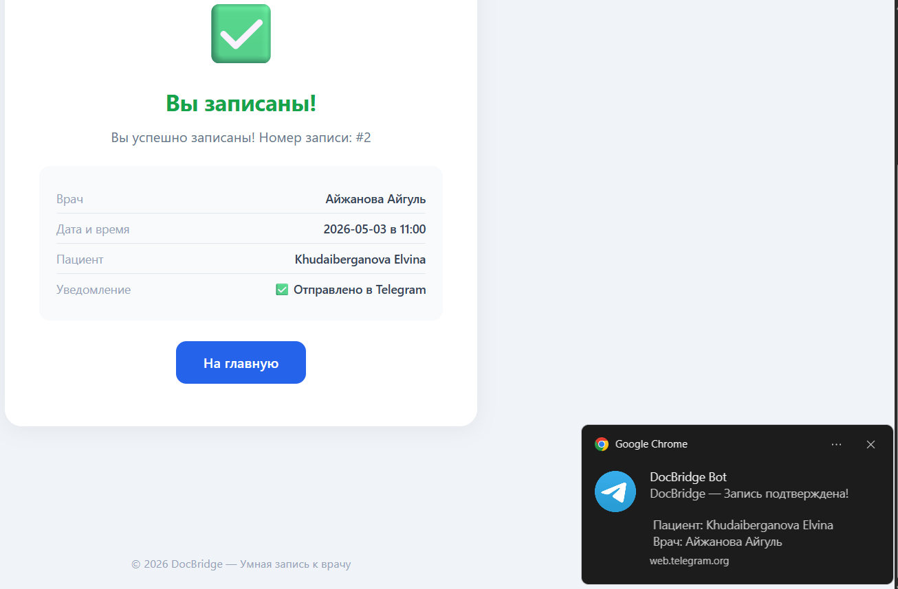

<div align="center">

# 🏥 DocBridge

### Speak your symptom. Find your doctor. Book instantly.

[](https://docbridge-770d.onrender.com)
[](https://github.com/aoutvina/docbridge)

</div>

---

## 🤔 The Problem

> *"My throat hurts. Do I need a therapist? An ENT? I don't know. I'll just call and hope for the best."*

Millions of patients book the **wrong doctor** every day. Elderly people struggle with complex apps. Clinics lose time on misdirected appointments.

---

## 💡 Our Solution

**DocBridge** is an intelligent symptom-to-appointment pipeline.

| Instead of... | You just... |
|---|---|
| ❌ Guessing which doctor to pick | ✅ Describe your symptom |
| ❌ Calling the clinic | ✅ Speak or type naturally |
| ❌ Waiting on hold | ✅ Get instant recommendation |
| ❌ Hoping it's the right specialist | ✅ Book the right doctor in 30 seconds |

---

## 🎥 How It Works

<div align="center">

| 1. Describe Symptom | 2. Get Recommendation | 3. Choose Slot |
|---|---|---|
|  |  |  |

| 4. Confirm Booking | 5. Get Telegram Alert |
|---|---|
|  |  |

</div>

---

## ⚡ What Makes It Different

| Feature | Why It's Cool |
|---|---|
| 🎤 **Voice-first** | Speak your symptom. No typing needed. Perfect for elderly users. |
| 🧠 **Smart, not AI-hype** | 82-rule expert system. Instant. Free. 100% explainable. No ChatGPT bills. |
| ⚠️ **Emergency detection** | Says "heart + pain + pressure" → warns about possible heart attack. |
| 📱 **Telegram, not email** | Kazakhstan's #1 messenger. Instant booking confirmation. |
| 🌐 **Live & free** | Deployed on Render. Zero hosting cost. |

---

## 🚀 Quick Start

```bash
git clone https://github.com/aoutvina/docbridge.git
cd docbridge
pip install -r requirements.txt
python app.py
Open http://127.0.0.1:5050 — that's it.

## 🧪 Try These Symptoms

| Say or type... | System recommends... |
|---|---|
| "болит горло, температура" | ENT + Therapist |
| "сыпь на руках и чешется" | Dermatologist |
| "болит сердце и давит" | ⚠️ Cardiologist (URGENT) |
| "плохо вижу, глаза устают" | Ophthalmologist |
| "болит зуб, опухла десна" | Dentist |

---

## 🛠 Built With

Python • Flask • SQLite • Web Speech API • Telegram Bot API • Gunicorn • Render

---

## 👥 Team

| Name | Role |
|---|---|
| Khudaiberganova Elvina | Lead & Backend |
| Aidarbekkyzy Aigerim | Frontend & Design |
| Kemalova Ayaulym | Database & QA |
| Akylbekkyzy Nazerke | Documentation |

**SDU University • INF395 • 2026**

---

<div align="center">

**[🔗 Open Live Demo](https://docbridge-770d.onrender.com)** • **[📄 Full Report](REPORT.md)**

</div>